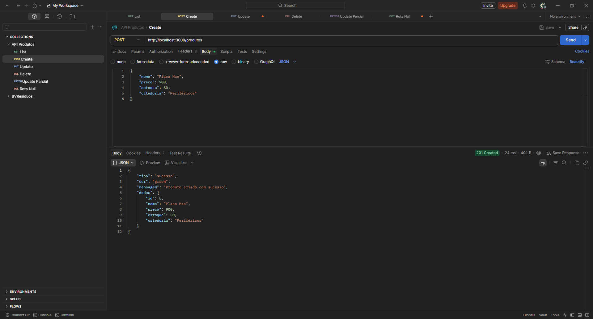
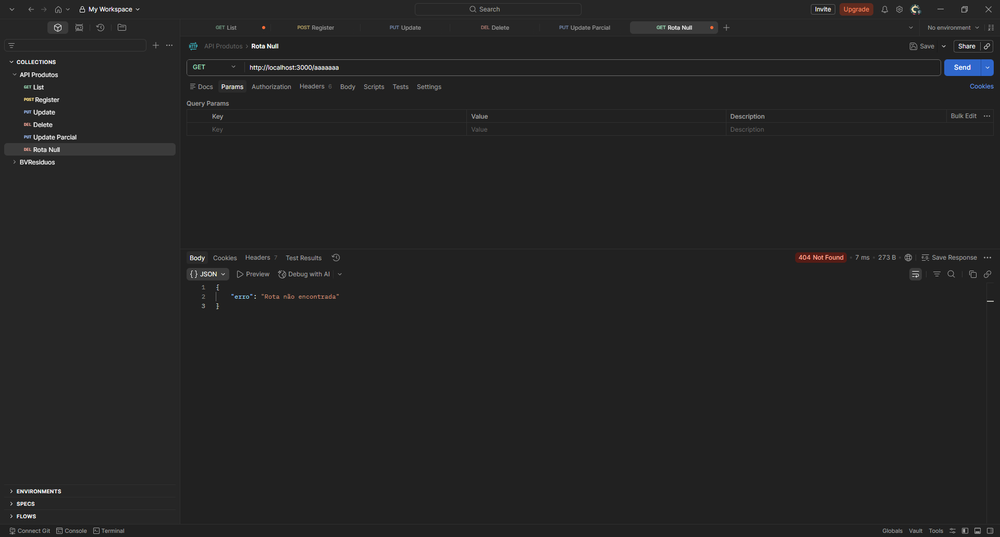

# 📦 RESTful Products API

## 📌 About

This project is a RESTful API built with Node.js and Express, focused on applying industry best practices, including:

* Semantic URIs (plural nouns)
* Proper HTTP methods
* Correct status codes
* Data validation
* Standardized responses

---

## ⚙️ Installation

```bash
npm init -y
npm install express colors
```

---

## ▶️ Running the application

```bash
node server.js
```

---

## 🔄 Run with auto-reload

```bash
node --watch server.js
```

---

## 🌐 Server

```
http://localhost:3000
```

---

## 🔐 Environment Variables

Create a `.env` file in the root:

```env
PORT=3000
```

---

## 📡 Headers

All requests must include:

```
Content-Type: application/json
```

---

## 📁 Project Structure

```
products-api/
├── utils/
│   └── response.js
├── prints/
│   ├── GET-produto.png
│   ├── GET-404.png
│   ├── POST-create.png
|   ├── POST-create-erro.png
│   ├── POST-400.png
│   ├── PUT-update.png
│   ├── DELETE-produto.png
|   ├── DELETE-erro.png
│   ├── Logs.png
├── server.js
├── package.json
└── README.md
```

---

## 🔗 Endpoints

| Method | Route          | Description                |
| ------ | -------------- | -------------------------- |
| GET    | /produtos      | List all products          |
| GET    | /produtos/{id} | Get product by ID          |
| POST   | /produtos      | Create a new product       |
| PUT    | /produtos/{id} | Fully update a product     |
| PATCH  | /produtos/{id} | Partially update a product |
| DELETE | /produtos/{id} | Delete a product           |
| GET    | /health        | API health check           |

---

## 📥 Example Request (POST)

```json
{
  "name": "Laptop",
  "price": 5000,
  "stock": 10,
  "category": "Electronics"
}
```

---

## 📤 Response Pattern

### ✅ Success

```json
{
  "status": 200,
  "type": "success",
  "message": "Operation completed successfully",
  "data": {}
}
```

---

### ❌ Error

```json
{
  "status": 404,
  "error": "Not Found",
  "message": "Product not found"
}
```

---

### ⚠️ Validation Error

```json
{
  "status": 400,
  "error": "Bad Request",
  "message": "Name and price must be greater than zero"
}
```

---

## 📊 Example Responses

### GET /products — Success (200)

```json
[
  {
    "id": 1,
    "name": "Gaming Laptop",
    "price": 7500,
    "stock": 30,
    "category": "Electronics"
  }
]
```

---

### GET /products/{id} — Not Found (404)

```json
{
  "status": 404,
  "error": "Not Found",
  "message": "Product not found"
}
```

---

### POST /products — Created (201)

```json
{
  "status": 201,
  "type": "success",
  "message": "Product created successfully",
  "data": {
    "id": 3,
    "name": "Mouse",
    "price": 100,
    "stock": 20,
    "category": "Electronics"
  }
}
```

---

### POST /products — Validation Error (400)

```json
{
  "status": 400,
  "error": "Bad Request",
  "message": "Name and price must be greater than zero"
}
```

---

## 🧪 Tests

Tested scenarios using Postman:

* ✅ GET /produtos → 200
* ❌ GET /produtos/{id} → 404
* ✅ POST valid → 201
* ❌ POST invalid → 400
* ✅ PUT → 200
* ✅ PATCH → 200
* ✅ DELETE → 204

---
## 📸 Test Evidence

### 🖥️ Logger


---

### ✅ Success

#### GET /produtos — List Products (200)


#### GET /produtos/{id} — Get Product by ID (200)


#### POST /produtos — Create Product (201)


#### DELETE /produtos/{id} — Delete Product (204)


#### PATCH /produtos/{id} — Partially Update Product (200)


---

### ❌ Errors

#### GET /produtos/{id} — Product Not Found (404)


#### GET /invalid-route — Endpoint Not Found (404)


---

## 📝 Logger

All requests are logged in the terminal:

```
GET /produtos - 200 - 3ms
POST /produtos - 400 - 1ms
POST /produtos - 201 - 1ms
PUT /produtos/999 - 404 - 1ms
PUT /produtos/5 - 200 - 0ms
DELETE /produtos/9999 - 404 - 1ms
DELETE /produtos/5 - 200 - 0ms
GET /aaaaaaa - 404 - 1ms
PATCH /produtos/999999 - 404 - 1ms
PATCH /produtos/5 - 404 - 0ms
PATCH /produtos/2 - 400 - 1ms
PATCH /produtos/2 - 200 - 0ms
```

---

## 👨‍💻 Author

Elyton Moreira
