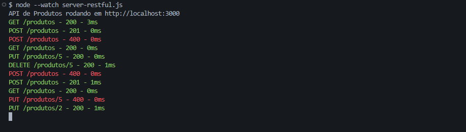
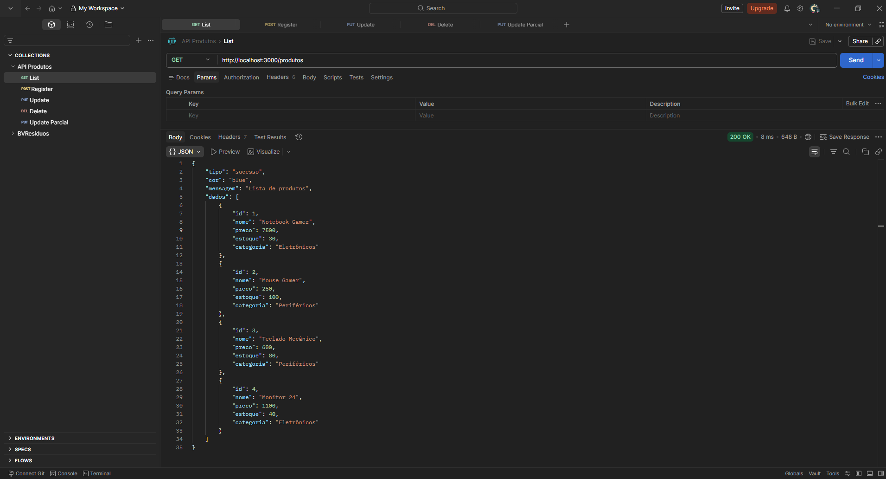
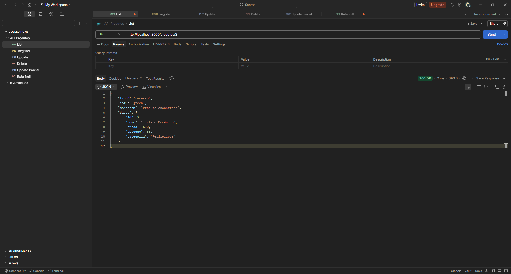
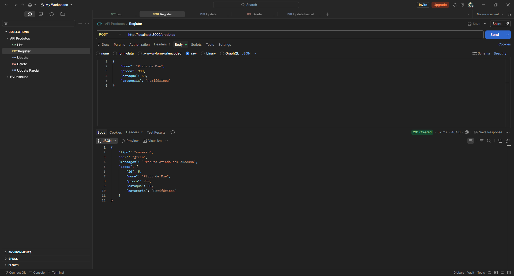
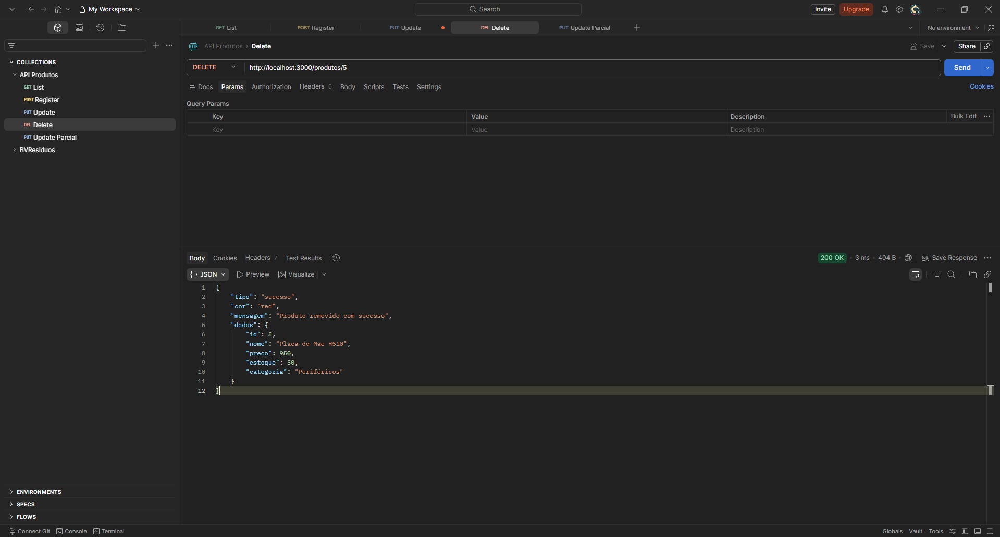
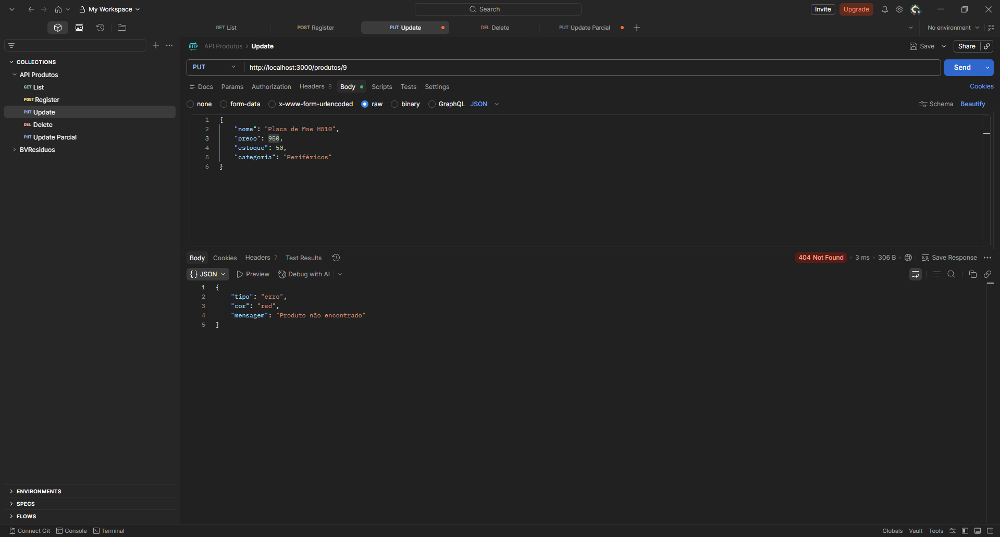

# 📦 API RESTful de Produtos

## 📌 Sobre

API desenvolvida em Node.js com Express com foco na **refatoração para padrões RESTful**, aplicando boas práticas de mercado como:

* URIs semânticas (substantivos no plural)
* Métodos HTTP corretos
* Status codes adequados
* Validação de dados
* Padronização de respostas

---

## ⚙️ Instalação das dependências

```bash
npm init -y
npm install express
npm install colors
```

---

## ▶️ Como rodar

```bash
node server-restful.js
```

---

## 🔄 Rodar com atualização automática

```bash
node --watch server-restful.js
```

---

## 📁 Estrutura de pastas

```
minha-api-restful/
├── utils/
│   └── response.js
├── screenshots-postman/
│   ├── GET-produtos.png
│   ├── GET-404.png
│   ├── POST-criar.png
│   ├── POST-erro-400.png
│   ├── PUT-produtos.png
|   |── PUT-erro.png   
│   ├── DELETE-Produtos.png
|   ├── DELETE-erro.png
|   ├── Log.png
|
├── server-restful.js
├── package.json
└── README.md
```

---

## 🔗 Endpoints

| Método | Rota          | Descrição                     |
| ------ | ------------- | ----------------------------- |
| GET    | /produtos     | Lista todos os produtos       |
| GET    | /produtos/:id | Busca produto por ID          |
| POST   | /produtos     | Cria novo produto             |
| PUT    | /produtos/:id | Atualiza produto completo     |
| PATCH  | /produtos/:id | Atualiza produto parcialmente |
| DELETE | /produtos/:id | Remove produto                |

---

## 📥 Exemplo de requisição (POST)

```json
{
  "nome": "Notebook",
  "preco": 5000,
  "estoque": 10,
  "categoria": "Eletrônicos"
}
```

---

## 📤 Padrão de respostas

### ✅ Sucesso

```json
{
  "tipo": "sucesso",
  "cor": "green",
  "mensagem": "Operação realizada com sucesso",
  "dados": {}
}
```

---

### ❌ Erro

```json
{
  "tipo": "erro",
  "cor": "red",
  "mensagem": "Recurso não encontrado"
}
```

---

### ⚠️ Dados inválidos

```json
{
  "tipo": "invalido",
  "cor": "orange",
  "mensagem": "Nome e preço > 0 obrigatórios"
}
```

---

## 📊 Exemplos de respostas

### GET /produtos — Sucesso (200)

```json
[
  {
    "id": 1,
    "nome": "Notebook Gamer",
    "preco": 7500,
    "estoque": 30,
    "categoria": "Eletrônicos"
  }
]
```

---

### GET /produtos/999 — Não encontrado (404)

```json
{
  "tipo": "erro",
  "cor": "red",
  "mensagem": "Produto não encontrado"
}
```

---

### POST /produtos — Criado (201)

```json
{
  "tipo": "sucesso",
  "cor": "green",
  "mensagem": "Produto criado com sucesso",
  "dados": {
    "id": 3,
    "nome": "Mouse",
    "preco": 100,
    "estoque": 20,
    "categoria": "Eletrônicos"
  }
}
```

---

### POST /produtos — Erro (400)

```json
{
  "tipo": "invalido",
  "cor": "orange",
  "mensagem": "Nome e preço > 0 obrigatórios"
}
```

---

## 🧪 Testes realizados

Cenários testados no Postman:

* ✅ GET /produtos → 200
* ❌ GET /produtos/999 → 404
* ✅ POST válido → 201
* ❌ POST inválido → 400
* ✅ PUT → 200
* ✅ PATCH → 200
* ✅ DELETE → 204


## Evidências de teste

### Logger no terminal


### Sucesso

#### GET /produtos — Lista todos (200)


#### GET /produtos/3 — Busca por id (200)


#### POST /produtos — Cadastro Produto (201)


#### DELETE /produtos — Delete Produto(204)


#### PATCH /produtos/:id — Atualização parcial (200)


### Erros

#### GET /produtos/9 — Produto não encontrado (400)


#### GET /aaaa — Rota inexistente (404)


## 📝 Logger

Todas as requisições são registradas no terminal:

```
GET /produtos - 200 - 3ms
POST /produtos - 201 - 0ms
POST /produtos - 400 - 0ms
GET /produtos - 200 - 0ms
PUT /produtos/5 - 200 - 0ms
DELETE /produtos/5 - 200 - 1ms
POST /produtos - 400 - 0ms
POST /produtos - 201 - 1ms
GET /produtos - 200 - 0ms
PUT /produtos/5 - 400 - 0ms
PUT /produtos/2 - 200 - 1ms
```

---

## 👨‍💻 Autor

Elyton Moreira

